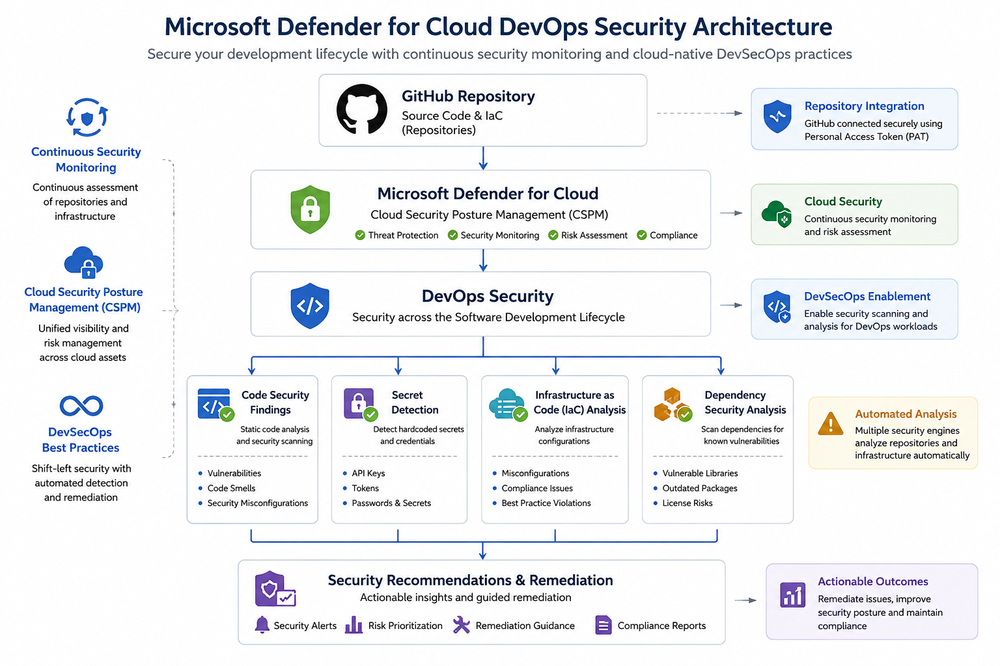
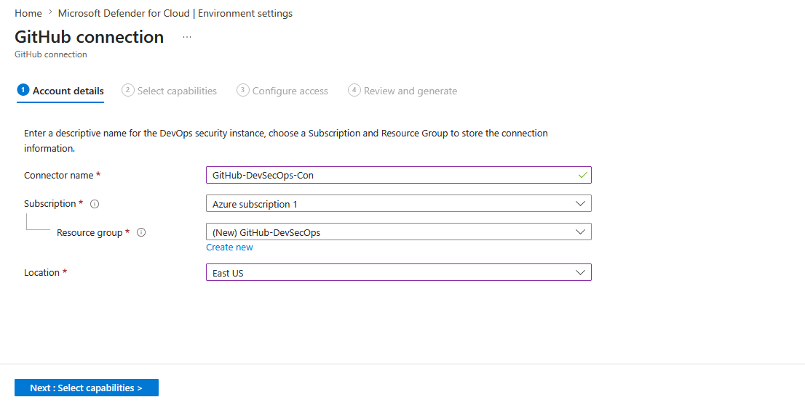
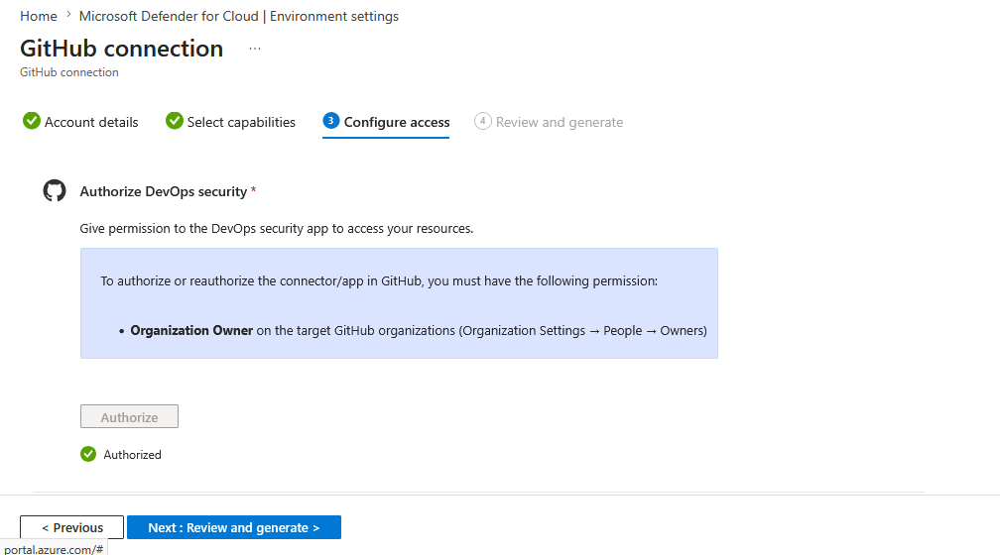
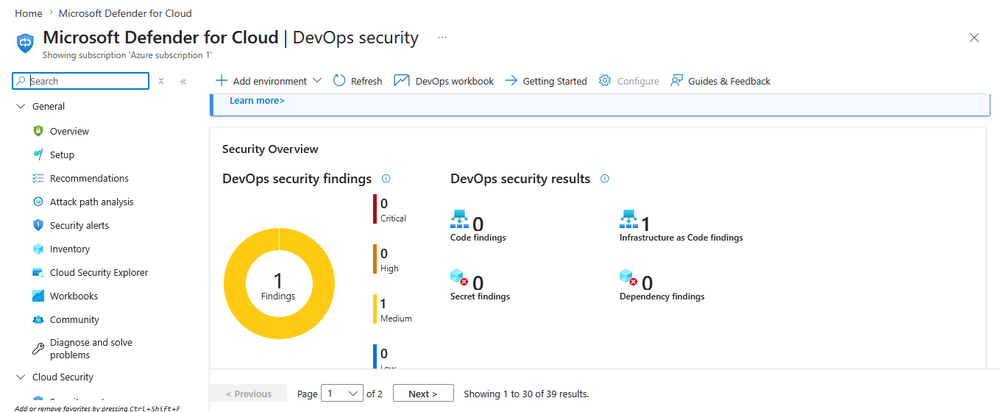

<h1 align="center">🛡️ Microsoft Defender for Cloud DevOps Security Lab</h1>

<p align="center">
  End-to-End Implementation of Microsoft Defender for Cloud DevOps Security by Integrating GitHub Repositories, Infrastructure as Code (IaC) Analysis, Security Posture Management, and Cloud-Native DevSecOps Monitoring.
</p>

---

# 🚀 Project Banner


---

<p align="center">
  
  
  
  
</p>

---

# 📖 Executive Summary

Modern software development requires security to be integrated throughout the Software Development Lifecycle (SDLC). This project demonstrates how Microsoft Defender for Cloud can be integrated with GitHub repositories to provide centralized security visibility, Infrastructure as Code (IaC) assessments, repository security monitoring, and DevSecOps governance.

The implementation enables organizations to proactively identify security risks, misconfigurations, and vulnerabilities before they reach production environments.

---

# 🎯 Project Objectives

- Integrate GitHub with Microsoft Defender for Cloud
- Configure DevOps Security capabilities
- Enable Cloud-Native DevSecOps monitoring
- Perform Infrastructure as Code (IaC) security assessments
- Review and analyze security findings
- Strengthen software supply chain security
- Improve security posture across development workflows

---

# 🏗️ Solution Architecture



### Architecture Flow

```text
GitHub Repository
        │
        ▼
Microsoft Defender for Cloud
        │
        ▼
DevOps Security
        │
 ┌──────┼─────────┬──────────┬──────────┐
 ▼      ▼         ▼          ▼
Code   Secrets   IaC     Dependencies
Findings Findings Findings Findings
        │
        ▼
Security Recommendations
```

---

# ⚙️ Technologies Used

| Technology | Purpose |
|------------|----------|
| Microsoft Defender for Cloud | Cloud Security Posture Management |
| GitHub | Source Code Repository |
| Azure Subscription | Cloud Environment |
| Azure Resource Groups | Resource Organization |
| Personal Access Token (PAT) | Secure Authentication |
| DevOps Security | Security Monitoring |
| Infrastructure as Code (IaC) | Configuration Security Analysis |

---

# 🚀 Lab Walkthrough

## Step 1 – Create GitHub Connection

A GitHub connection was established within Microsoft Defender for Cloud and linked to the Azure subscription and dedicated resource group.



---

## Step 2 – Configure Security Capabilities

DevOps Security capabilities were selected to enable repository security assessment and continuous monitoring.



---

## Step 3 – Configure GitHub Authentication

A GitHub Personal Access Token (PAT) was generated and configured to authorize Microsoft Defender for Cloud access.

.png)

### Permissions Granted

- Repository Access
- Security Events
- Repository Metadata
- Repository Visibility

---

## Step 4 – Authorize Defender for Cloud

The GitHub organization was authorized to allow Microsoft Defender for Cloud DevOps Security to assess connected repositories.

### Security Benefits

- Centralized Security Visibility
- Continuous Repository Assessment
- Secure DevSecOps Onboarding
- Security Governance

---

## Step 5 – Review Security Findings

After successful integration, Microsoft Defender for Cloud generated DevOps Security findings and recommendations.



### Findings Categories

- Infrastructure as Code (IaC)
- Secret Detection
- Dependency Security
- Code Security Analysis

---

# 🔍 Security Findings Analysis

Microsoft Defender for Cloud continuously evaluates connected repositories and identifies potential security risks.

### Key Observations

✅ Infrastructure as Code analysis enabled

✅ Security posture visibility established

✅ Centralized DevSecOps monitoring configured

✅ Cloud-native governance implemented

✅ Repository security assessments operational

---

# 🛡️ Security Concepts Demonstrated

| Security Control | Description |
|------------------|-------------|
| Cloud Security Posture Management (CSPM) | Security visibility across cloud environments |
| DevSecOps | Security integrated into development workflows |
| GitHub Integration | Repository onboarding and monitoring |
| Infrastructure as Code Security | Configuration validation and analysis |
| Secret Detection | Credential exposure monitoring |
| Security Recommendations | Actionable remediation guidance |

---

# 🚀 Skills Demonstrated

- Microsoft Defender for Cloud
- Azure Security
- Cloud Security Posture Management (CSPM)
- DevSecOps
- GitHub Security Integration
- Infrastructure as Code Security
- Security Governance
- Security Monitoring
- Security Posture Assessment

---

# 📚 Key Learning Outcomes

This project provided practical experience in:

- Integrating GitHub with Microsoft Defender for Cloud
- Understanding DevOps Security workflows
- Investigating security findings
- Managing repository security posture
- Applying cloud-native security best practices

---

# 🔮 Future Enhancements

- GitHub Actions Security Monitoring
- Secret Scanning Scenarios
- Dependency Vulnerability Assessment
- Azure DevOps Integration
- Multi-Repository Security Governance
- CI/CD Security Controls

---

# 📊 Project Outcomes

| Outcome | Status |
|----------|---------|
| GitHub Integration Completed | ✅ |
| DevOps Security Enabled | ✅ |
| PAT Authentication Configured | ✅ |
| Security Findings Generated | ✅ |
| IaC Assessment Enabled | ✅ |
| Security Posture Monitoring Enabled | ✅ |

---

# 🎓 AZ-500 Relevance

This project aligns with Microsoft Azure Security Engineer (AZ-500) objectives related to:

- Microsoft Defender for Cloud
- DevOps Security
- Security Posture Management
- Security Monitoring
- Infrastructure Security
- GitHub Security Integration

---

# 👨‍💻 Author

## Amal Udayanga Basnayake

🎓 BSc (Hons) Cyber Security Undergraduate

☁️ Azure Security Enthusiast

🛡️ Cloud Security | AI Security | DevSecOps

🚀 Future Microsoft Security Engineer

---

## 🔗 Connect With Me

- LinkedIn: www.linkedin.com/in/amal-udayanga-basnayake
- GitHub: github.com/AmalUBasnayake

---

⭐ If you found this project useful, feel free to star the repository.
